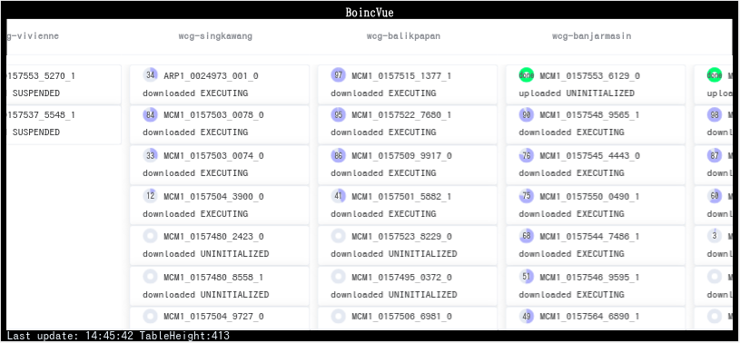

# BoincVue
Web status viewer for BOINC

## Project Goal
- Contribute for [World Community Grid](https://www.worldcommunitygrid.org/).

## Dependency
### Backend
#### Basic
- [BOINC client](https://packages.debian.org/stable/boinc-client)

#### Scripts
- [bash](https://packages.debian.org/stable/bash)
- [sed](https://packages.debian.org/stable/sed)
- [awk](https://packages.debian.org/stable/gawk)
- [jq](https://packages.debian.org/stable/jq)

#### Server
- HTTP Web server. (Apache, Nginx, other..)

### Frontend
- Vue.js (Runtime loading from CDN)
- ElementUI (Runtime loading from CDN)

## Setup
getting ready..

## License
MIT License.
